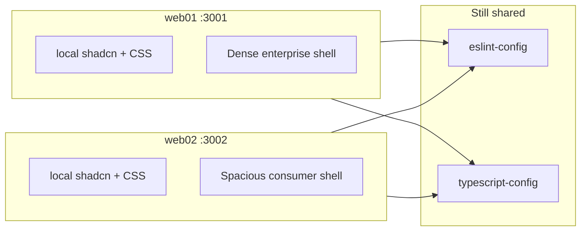

# shadcn/ui monorepo template

This is a Next.js monorepo template with shadcn/ui.

## Adding components

To add components to your app, run the following command at the root of your `web` app:

```bash
pnpm dlx shadcn@latest add button -c apps/web
```

This will place the ui components in the `packages/ui/src/components` directory.

## Using components

To use the components in your app, import them from the `ui` package.

```tsx
import { Button } from "@workspace/ui/components/button";
```

# SaaS UI bake-off

Fully isolate web01 and web02 so each owns its own shadcn/UI stack, then implement the same generic SaaS shell twice: dense enterprise (web01) vs spacious consumer (web02). Auth stays mocked so the bake-off is visual and navigable, not a backend project.

**Todos**

- [ ] Move shadcn/CSS/utils into each app; remove packages/ui and @workspace/ui wiring
- [ ] Add identical routes, mock data, and auth/dashboard chrome in both apps
- [ ] Style web01 as a compact enterprise admin (tokens, sidebar, tables, landing)
- [ ] Style web02 as a spacious consumer SaaS (tokens, airy layout, marketing landing)
- [ ] Update README for isolated apps, ports, and how to run the bake-off

## Isolated SaaS UI bake-off (web01 vs web02)

The monorepo already has two nearly identical Next.js 16 apps ([apps/web01](apps/web01) on `:3001`, [apps/web02](apps/web02) on `:3002`) that share [`packages/ui`](packages/ui). They will become **fully isolated product shells** with the same information architecture and different density.

Keep [`packages/eslint-config`](packages/eslint-config) and [`packages/typescript-config`](packages/typescript-config) shared. Remove `@workspace/ui`.



### 1. Isolate each app’s UI

For **each** of `web01` and `web02`:

- Point [`components.json`](apps/web01/components.json) at **local** paths (`app/globals.css`, `@/components/ui`, `@/lib/utils`). Stop targeting `packages/ui`.
- Own CSS, PostCSS, `cn()`, and shadcn components under the app (`app/globals.css`, `lib/utils.ts`, `components/ui/`).
- Drop `@workspace/ui` from `package.json`, `tsconfig.json` paths, `next.config.ts` `transpilePackages`, `layout.tsx` imports, and `postcss.config.mjs`.
- Install shadcn deps **per app** (`clsx`, `tailwind-merge`, `class-variance-authority`, `@base-ui/react`, `shadcn`, `tailwindcss`, `tw-animate-css`, etc.).
- Run `pnpm dlx shadcn@latest add … -c apps/web01` (and the same for web02) so components land in that app only.

Then delete [`packages/ui`](packages/ui) and update [README.md](README.md) (current add-component docs still say `apps/web`).

Consult Next.js 16 docs in `node_modules/next/dist/docs/` before adding routes/layouts (repo `AGENTS.md` warning).

### 2. Same product, two visual systems

**Identical routes and mock data** in both apps (click-through only — no real auth, DB, or billing):

| Route | Purpose |
|---|---|
| `/` | Marketing landing |
| `/login`, `/signup` | Auth screens; submit navigates to `/app` |
| `/app` | Dashboard home (KPIs + activity/table) |
| `/app/customers` | Dense/spacious customer table |
| `/app/settings` | Profile / workspace placeholders |
| `/app/billing` | Plan + invoice placeholders |

Shared IA details:

- App chrome: sidebar + header (user menu, theme toggle). Keep the existing `d` hotkey via each app’s local `theme-provider`.
- Dummy data in each app (`lib/mock-data.ts`) with the same records so comparison is fair.
- Login/signup use shadcn `Field` + `FieldGroup` (not ad-hoc form layout).

**web01 — dense enterprise**

- Compact type (`text-sm` body), tight gaps (`gap-2` / `p-3`), smaller radius (`--radius` ~ `0.375rem`).
- Collapsible icon sidebar; KPI strip of many small metrics; compact table with filters.
- Landing is a product/docs-style page (short hero, feature list, table-of-contents energy), not a big marketing splash.

**web02 — spacious consumer**

- Larger type and padding, wider content, larger radius (`--radius` ~ `1rem`).
- Airy sidebar/header; 3 large stat cards; friendlier empty/help copy; more `Empty` / marketing-like cards.
- Landing is a real marketing page: large hero, feature grid, CTA into `/signup`.

Both stay on **base-nova + semantic tokens** (`bg-background`, `text-muted-foreground`). Density comes from tokens, spacing, and composition — not raw color overrides.

shadcn components to add independently in each app (same set): `button`, `card`, `input`, `field`, `label`, `separator`, `avatar`, `badge`, `table`, `dropdown-menu`, `sidebar`, `sheet`, `tabs`, `sonner`, `empty`, `breadcrumb`.

### 3. How you choose a winner

Run both:

```bash
pnpm --filter web01 dev   # http://localhost:3001
pnpm --filter web02 dev   # http://localhost:3002
```

Walk the same path in each: landing → signup → dashboard → customers → settings → billing. Compare scanability, whitespace, table readability, and whether the landing matches the in-app feel.

**After you pick:** keep the winner as the product direction; delete the other app in a follow-up. Do not reintroduce a shared UI package unless you later add a second real app.

### Out of scope

- Real auth, database, Stripe, multi-tenant tenancy
- Picking a winner automatically or deleting an app in this pass
- Sharing UI components between the two apps
